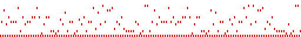

# 🎼 Perfect Shuffle Music Composer



An experimental **evolutionary music generator** that uses symbolic recombination instead of traditional randomness.  
Each generation produces 48 unique MIDI sequences based on **perfect shuffle crossover**, and you — the listener — guide the evolution.

Originally written in PHP (2017). Now fully rebuilt in **Node.js** with a lightweight web interface.

---

## 🚀 Features

- ✅ Simple browser-based interface for interactive selection
- 🎵 Generates 48 MIDI sequences per generation
- 🧬 Select your 16 favorite tracks and click **Evolve** to produce the next generation
- 🔁 Uses **perfect shuffle crossover** to blend melodies
- 🎲 Adds random "newbie" sequences to keep diversity alive
- 🎼 Based on a symbolic scale (default: natural minor)
- 🎚️ Tunable `shift` parameter subtly alters recombination rhythm
- 🧠 Zero machine learning — pure symbolic evolution

---

## 🧠 Concept

This project explores how **structured crossover operations** — like perfect shuffles — can produce meaningful musical patterns. Instead of noise or chaos, it uses **symbolic determinism**:  
parent1 + parent2 → interleaved → offset → new generation.

It's like gene-splicing musical DNA — but with math and groove.

---

## 📦 Installation

```bash
git clone https://github.com/xcontcom/perfect-shuffle-music-composer.git
cd perfect-shuffle-music-composer
npm install
node miditest.js
```

This project depends on:

```
midi-writer-js
express
```

Install via:

```bash
npm install midi-writer-js express
```

Then open your browser and go to:

```
http://localhost:3000
```

---

## 🎛️ Usage

1. Visit the web interface.
2. Click to **preview** any of the 48 generated MIDI sequences.
3. Select exactly **16** that you like by checking the boxes.
4. Hit **Evolve** — a new generation will be created using perfect shuffle crossover.
5. Or click **Recreate** to generate a fresh random population.

---

## 🧬 Algorithm

Each new generation is built from:
- 16 survivors (top 16 selected by the user)
- 16 fresh individuals (randomly generated using a fixed scale)
- These parameters can be customized

Pairs of survivors are combined via **perfect shuffle crossover**:

```js
for (let j = 0; j < notescount; j++) {
    tarray[j * 2] = parent1[j];
    tarray[j * 2 + 1] = parent2[j];
}
```

Then two children are formed by slicing this interleaved array with an optional offset (`shift`), like so:

```js
child1[j] = tarray[j];
child2[j] = tarray[(j + shift) % tarray.length];
```

Changing `shift` tweaks the musical phrasing across generations.

---

## 🎵 Examples

[Listen to Sample 1](example/1.wav)

[Listen to Sample 2](example/2.wav)

[Listen to Sample 2](example/3.wav)

[Listen to Sample 2](example/4.wav)

---

## 📁 File Structure

```
legacy/                 # PHP
miditest.js             # Main Node.js app
public/
  └── midi/             # Output MIDI files
population.json         # Saved population data (auto-generated)
different mixing method # Different mixing method
```

---

## 🧑‍🚀 Author

Made by [Serhii Herasymov](https://github.com/xcontcom), based on chaotic late-night discoveries in 2017 and reborn with clarity in 2025.

---

## ⚖️ License

MIT License. See [LICENSE](LICENSE) for details.
